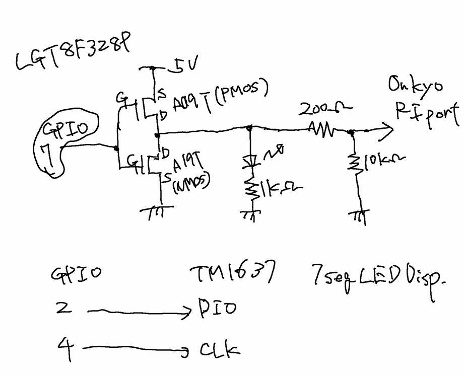

# ONKYO IR scan

TX-NX7SR

Onkyo FR-N7SX(X-N7SX)

|IR CODE| Function|
|---|---|
|0x70 | TAPE turn on|
|0x73 | CD |
|0x79 | CD Dubbing? |
|0x77 | CD PLAY|
|0x79 | CD PAUSE |
|0x7B | CD STOP |
|0x82 | TAPE |
|0x170 | DOCK |

## Circuit

Note: GPIO output is inverted, due to inverted MOSFET output circuit.

